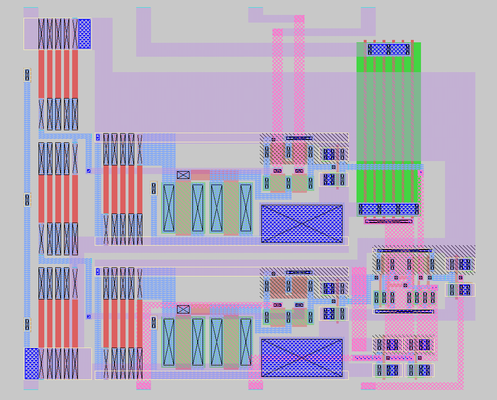

What?
=====
PRE555 is a hierarchical implementation of a CMOS [555 timer IC](https://en.wikipedia.org/wiki/555_timer_IC#) using the [SkyWater open source PDK](https://github.com/google/skywater-pdk), including schematic capture, simulations, layout and LVS verification.

It was created as an exercise in analog IC design and layout, rather than as something practical for manufacture or use.



Running LVS with netgen
=======================
A script is provided for convenient LVS verification of each design unit. To use it, run:
```
cd lvs
./lvs.sh <unit name>
```
The script tries to find your PDK installation if PDK_ROOT is not set, and will try to use the latest available version of each netlist, searching the lvs, mag and ~/.xschem/simulations directories.

Note that Magic may wrap the top level cell in a SPICE file in a subcircuit, which will cause LVS to fail. This can be fixed easily by manually removing the appropriate subcircuit delimiters (usually the last ones in the file).